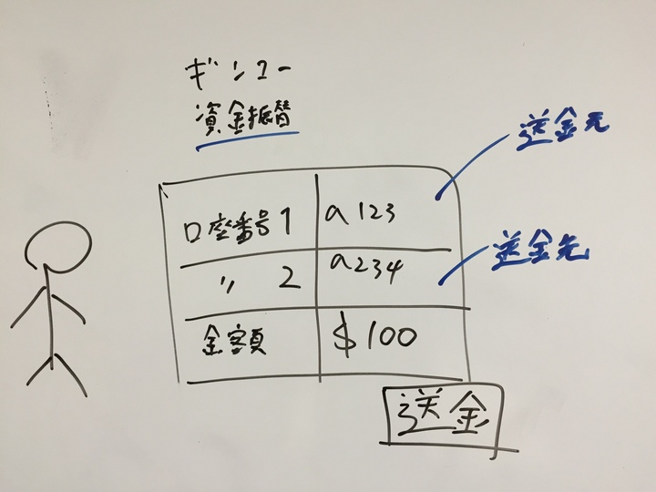

# 第２部 モデル駆動設計の構成要素

> ある種の意思決定をするこによって、モデルと実装の協調が保たれ

**責務駆動設計**

```
オブジェクトは：
・情報を知っている
・サービスを提供する
・判断する（判断ルールを知っている）
・他のオブジェクトとの結びつきを維持する

オブジェクトが演じる典型的な役割（ロール）は：
・情報提供者
・オブジェクト間の関係の維持役
・加工や計算などの付加価値サービスの提供者
・調整役　（適切なオブジェクトにタスクを委譲する）
・制御役　（判断を行い、他のオブジェクトにアクションを指示する）
・インタフェース役　（異なる世界のオブジェクト間の通信を取り持つ）
```

賢すぎるオブジェクトはアンチパターン  

```
・責務が多すぎることにより、依存関係が複雑になる
・レイヤーの境界があいまいになりやすい
・実装時の明確な指針がないため、知識の分散が生じやすい
```

> 契約による設計


**契約プログラミング**  

契約による設計は、正しいソフトウェアおよびプログラムとは、要求されたこと以上のこともそれ以下のことも行わない。  
呼び出す側で、引数や戻り値の妥当性を検証するのか？それとも呼び出される側？  
どちらかに責任を押し付ける。  
契約を違反していた場合、例外を投げる。  
<br>

* 過剰防衛（やりすぎ）を防ぐ
* 責任がどちらにあるかをはっきりさせる

```php

$id   = $_GET['id'];
$name = $_GET['name'];

if (!is_numeric($id)) {
  throw new Exception('Not Numeric $id');
}

$obj = new OBJ();
$result = $obj->exec($id, $name);

if (empty($result)) {
  // $obj->execで例外投げてよ
  throw new Exception('Empty Result');
}
```


> ドメインの設計を、ソフトウェアシステムにおけるその他の関心ごとから分離することで、設計とモデルの繋がりが非常に明確になる


自分なりの解であるが、コアドメインは一様にして、複雑なものである。  
その中で、サブドメインを磨いていく。  
扱いやすい適切な粒度で、理解しやすい命名で。  
役割さえはっきりしていれば、サブドメイン同士の関係も明確になるはず。  
日常のドメインが表現豊かにでシンプルなれば、システムも表現豊かでシンプルになる。  
<br>

悪い例：Managerクラス  

# 第４章 ドメインを乖離する

> モデル要素を見た時に１つの体系として理解できる必要が大事


ネーミング大事だよ。 `Entity::Program` というモデル要素を見た時にそのドメイン内で、自明である必要がある。  
ドメインを日々磨いているとコードを書く時に困らない。  
<br>
> ドメインの概念を、ホストウェアの技術にしか関係しない概念と混同したり、システム全体の中に紛れ込んでドメインを見失ってしまったりすることを避けられるようになる

`Http::Request` というクラスをドメインのコンポーネントと混ぜるとわけわかんなくなるよ的な話？  

### 例 4.1 オンラインバンキングの機能をレイヤに分割する



ドメイン層とは、ビジネスロジックが詰まっている層のこと。  
<br>

### レイヤを関連付ける

* レイヤの分離
* ドメイン道の設計改善(さらに深いビジネスロジックの凝縮)

レイヤ同士は疎結合であるべき。  
設計の依存関係は1方向にだけ向けられる。  

協調動作をする時に、よいデザインパターン  
**オブザーバパターン** はよい。  

アプリケーション層は、本来の仕事に集中した状態に保ちたい。  
メッセージを **いつ** 送信するかは、 知っているがそれを **どのように** 行うかまでは背負わない。  

### アーキテクチャフレームワーク

メソッドシグネチャ  

* 引数
* メソッド名
* 戻り値

### ドメイン層はモデルが息づく場所

> ドメインロジックがプログラムの他の関心ごとと混ざり合っていたら、設計と実装をこの様に一致させることは現実的ではない

例えば何かの計算ロジックに、キャッシュの話がいきなり出てくると読みにくい。  
キャッシュの部分をラップして、ドメイン言葉に置き換える。  

### 利口なUI「アンチパターン」

### その他の乖離

